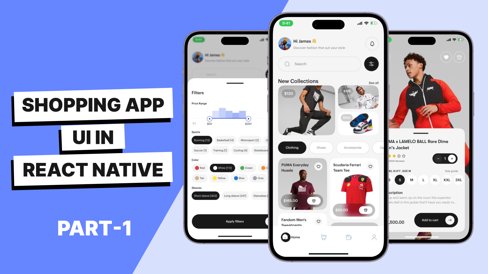

# React Native Shopping App UI

[Watch Part-1 on YouTube](https://youtu.be/qcN5B44cMHQ)

Hi guys 👋

In this video tutorial, I am going to implement this awesome Shopping app UI 😍. It is a modern UI. It has lots of layout elements to play with and you will learn a lot by implementing this UI in react native. It has grid layouts, a masonry list, a bottom sheet, blurred background, and lots of interesting things. This is a perfect UI for you to practice on.

We will learn how to implement React navigation with TypeScript and nested navigation 😎, How to use React Native Reanimated 🔥, how to add a react-native masonry list view 🖼️, how to add a grid layout in react native 🚀, and also a custom theme 🎨.

I hope you will find this react native shopping UI tutorial video help full and that you learn lots of things from this video.

## Designer

Please check out [Jamez](https://twitter.com/Jamez_uiux) on Twitter. He is the designer of the UI that I'm implementing in react native.

## Support

Also if you want to support me in making more of this free content then please consider subscribing and [buying me a coffee](https://buymeacoffee.com/rohid) if you can ☕. I will appreciate that 👐

Thank you 👐
